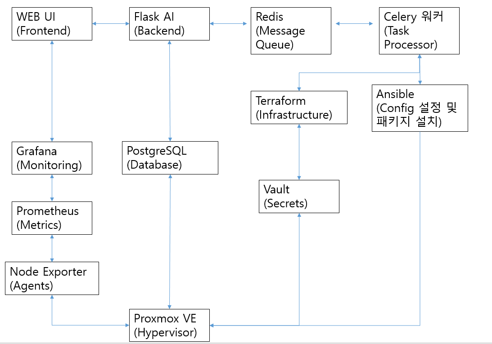

Terraform Proxmox Manager
==========================

이 프로젝트는 Proxmox 기반의 VM 라이프사이클을 Terraform, Ansible, Vault, Docker 기반 Monitoring(Prometheus/Grafana)과 연동해 관리하는 웹 애플리케이션입니다.

핵심 기능
- 서버 관리: 생성/시작/중지/재시작/삭제, 대량 작업, 상태 조회
- 역할/권한(IAM): 사용자/역할/권한 관리 UI 및 API
- 방화벽/보안그룹: 그룹/룰 관리, 서버에 적용/일괄 적용
- 모니터링: Prometheus/Grafana(Node Exporter), Docker Compose 구성과 자동 프로비저닝
- **실시간 알림 시스템**: SSE 기반 실시간 알림 (폴링 제거)
- **비동기 작업 처리**: Celery/Redis 기반 대용량 작업 처리
- **PostgreSQL 데이터베이스**: 확장성과 성능을 위한 DB 마이그레이션
- Vault: 비밀 관리(SSH 키 등) 및 Terraform 연계
- Datastore 관리: Proxmox 스토리지 자동 감지, DB 캐싱, 기본 설정 관리

빠른 시작
1) 필수 의존성 설치: Docker, Docker Compose, Python 3.10+, Terraform, Ansible
2) 프로젝트 클론 후 `.env` 작성(설치 스크립트에서 템플릿 제공)
   - **중요**: `PROXMOX_HDD_DATASTORE`, `PROXMOX_SSD_DATASTORE` 설정 필수
3) 가상환경 생성 및 패키지 설치, DB 초기화
4) **Redis & Celery 워커 시작**: `cd redis && docker-compose up -d`
5) 모니터링 스택 실행: `monitoring/start-monitoring.sh` 또는 `docker compose -f monitoring/docker-compose.yml up -d`
6) Flask 앱 실행: `python run.py`

## ⚠️ Proxmox Cloud-init 템플릿 사전 준비

### Proxmox에서 Cloud-init 템플릿 생성

이 시스템을 사용하기 전에 Proxmox에서 cloud-init을 지원하는 VM 템플릿을 생성해야 합니다.

#### 1. 기본 VM 생성
```bash
# Proxmox 웹 UI에서:
# 1. "Create VM" 클릭
# 2. VM ID: 8000 (템플릿용)
# 3. OS: Linux, Version: Rocky Linux 8/9
# 4. CPU: 2 cores, Memory: 2GB
# 5. Disk: 20GB
# 6. Network: vmbr0
```

#### 2. qcow2 이미지 다운
```bash
# Proxmox 서버에 SSH 접속 후:
cd /var/lib/vz/template/qcow2
wget https://download.rockylinux.org/pub/rocky/8/images/Rocky-8-GenericCloud.latest.x86_64.qcow2
```

#### 3. Cloud-init 설정
```bash
qm create 8000 --name "rocky8-cloudinit-template" --memory 2048 --cores 2 --net0 virtio,bridge=vmbr0
pvesm status
qm importdisk 8000 Rocky-8-GenericCloud.latest.x86_64.qcow2 local --format qcow2
```

#### 4. Cloud-Init 디스크 추가
```bash
qm set 8000 --ide2 local:cloudinit
qm set 8000 --boot c --bootdisk scsi0
qm set 8000 --serial0 socket --vga serial0
```

#### 5. 템플릿으로 변환
```bash
qm template 8000
# Proxmox CLI에서 템플릿 ID 확인
qm list | grep template
# 예: 9000 rocky-cloud-init template
```

### .env 파일 설정
```bash
# .env 파일에 템플릿 ID 추가
TEMPLATE_VM_ID=8000
```

### 지원 OS 템플릿
- **Rocky Linux 8/9**: 권장 (완전 지원)
- **CentOS 8/9**: 지원
- **Ubuntu 20.04/22.04**: 지원
- **RHEL 8/9**: 지원

### 주의사항
- **Cloud-init 필수**: 템플릿에 cloud-init이 설치되어 있어야 함
- **SSH 키**: 템플릿에 SSH 키가 설정되어 있어야 함
- **네트워크**: DHCP 설정이 되어 있어야 함
- **디스크**: 자동 확장이 가능해야 함

## ⚠️ 서버 생성 시 주의사항

### 서버 부팅 시간
- **서버 생성 후 완전한 부팅까지 5분 이상 소요**될 수 있습니다
- **역할 할당은 서버 생성 완료 5분 후**에 진행하세요
- **Ansible 작업이 3분 이상 걸리면** 서버가 아직 준비되지 않은 상태입니다

### 권장 워크플로우
1. 서버 생성 → 완료 알림 대기
2. **5분 대기** (서버 완전 부팅)
3. 역할 할당 실행
4. Ansible 작업이 3분 이상 걸리면 잠시 후 재시도

## ⚠️ Ansible 동적 인벤토리 실행 권한 설정

마운트 경로(`/data/terraform-proxmox/ansible`)에서 `dynamic_inventory.py` 실행 권한이 없거나 noexec 마운트 옵션으로 인해 Ansible 인벤토리 파싱이 실패할 수 있습니다. 다음을 확인하세요.

```bash
# 1) 실행 권한 부여 및 셰뱅 확인
sudo chmod +x /data/terraform-proxmox/ansible/dynamic_inventory.py
head -n1 /data/terraform-proxmox/ansible/dynamic_inventory.py
# 출력 예: #!/usr/bin/env python3

# 2) 줄바꿈 및 소유권 정리(선택)
sudo dos2unix /data/terraform-proxmox/ansible/dynamic_inventory.py || true
sudo chown <celery_user>:<group> /data/terraform-proxmox/ansible/dynamic_inventory.py

# 3) 마운트 noexec 확인
mount | grep /data/terraform-proxmox
# noexec이면 실행 불가 → exec로 재마운트하거나 정적 인벤토리(inventory.ini)로 우회

# 4) SELinux 사용 시(선택)
getenforce  # Enforcing이면 컨텍스트 이슈 가능
sudo chcon -t bin_t /data/terraform-proxmox/ansible/dynamic_inventory.py || true
```

증상 예시:
- Permission denied: '/data/terraform-proxmox/ansible/dynamic_inventory.py'
- PLAY RECAP: skipping: no hosts matched

위 조치 후에도 동일하면 `app/services/ansible_service.py`에서 정적 인벤토리(`inventory.ini`) 폴백 옵션을 활성화하세요.

## 🔧 Terraform 원격 서버 설정

### 기본 설정 (로컬 실행)
```bash
# .env 파일에 설정하지 않으면 로컬에서 terraform 실행
# 별도 설정 불필요
```

### 원격 서버 설정 (선택사항)
```bash
# .env 파일에 추가
TERRAFORM_REMOTE_ENABLED=true
TERRAFORM_REMOTE_HOST=terraform-server.example.com
TERRAFORM_REMOTE_PORT=22
TERRAFORM_REMOTE_USERNAME=terraform
TERRAFORM_REMOTE_DIR=/opt/terraform

# 인증 방법 선택 (하나만 설정)
# 방법 1: SSH 키 기반 (권장)
TERRAFORM_REMOTE_KEY_FILE=/path/to/private/key

# 방법 2: 패스워드 기반
TERRAFORM_REMOTE_PASSWORD=your_password

# 방법 3: SSH 에이전트 사용 (가장 간단)
# SSH 키를 에이전트에 추가: ssh-add ~/.ssh/id_rsa
# 환경 변수에서 패스워드/키 파일 설정하지 않음
```

### 원격 서버 준비
```bash
# 1. 원격 서버에 terraform 설치
wget https://releases.hashicorp.com/terraform/1.5.7/terraform_1.5.7_linux_amd64.zip
unzip terraform_1.5.7_linux_amd64.zip
sudo mv terraform /usr/local/bin/
sudo chmod +x /usr/local/bin/terraform

# 2. terraform 디렉토리 생성
sudo mkdir -p /opt/terraform
sudo chown terraform:terraform /opt/terraform

# 3. SSH 키 설정 (선택사항)
ssh-keygen -t rsa -b 4096 -f ~/.ssh/terraform_key
ssh-copy-id -i ~/.ssh/terraform_key.pub terraform@terraform-server.example.com
```

### 환경 변수 설명
| 변수명 | 필수 | 기본값 | 설명 |
|--------|------|--------|------|
| `TERRAFORM_REMOTE_ENABLED` | ❌ | `false` | 원격 서버 사용 여부 |
| `TERRAFORM_REMOTE_HOST` | ✅ | - | 원격 서버 호스트명/IP |
| `TERRAFORM_REMOTE_PORT` | ❌ | `22` | SSH 포트 |
| `TERRAFORM_REMOTE_USERNAME` | ✅ | - | SSH 사용자명 |
| `TERRAFORM_REMOTE_DIR` | ❌ | `/opt/terraform` | 원격 서버의 terraform 디렉토리 |
| `TERRAFORM_REMOTE_KEY_FILE` | ❌ | - | SSH 개인키 파일 경로 |
| `TERRAFORM_REMOTE_PASSWORD` | ❌ | - | SSH 패스워드 |

### 인증 방법별 설정 예시

#### SSH 키 기반 (권장)
```bash
TERRAFORM_REMOTE_ENABLED=true
TERRAFORM_REMOTE_HOST=terraform-server.example.com
TERRAFORM_REMOTE_USERNAME=terraform
TERRAFORM_REMOTE_KEY_FILE=/path/to/private/key
```

#### SSH 에이전트 사용 (가장 간단)
```bash
# SSH 키를 에이전트에 추가
ssh-add ~/.ssh/id_rsa

# 환경 변수 설정
TERRAFORM_REMOTE_ENABLED=true
TERRAFORM_REMOTE_HOST=terraform-server.example.com
TERRAFORM_REMOTE_USERNAME=terraform
# 패스워드나 키 파일 설정하지 않음
```

#### 패스워드 기반
```bash
TERRAFORM_REMOTE_ENABLED=true
TERRAFORM_REMOTE_HOST=terraform-server.example.com
TERRAFORM_REMOTE_USERNAME=terraform
TERRAFORM_REMOTE_PASSWORD=your_password
```

문서 링크(요약 허브)
- 설치/운영: `docs/INSTALLATION.md`, `docs/OPERATION_GUIDE.md`, `docs/TROUBLESHOOTING.md`
- 아키텍처: `docs/ARCHITECTURE.md`
- API 목록: `docs/API_REFERENCE.md`
- 기능별 문서:
  - 권한/역할: `docs/PERMISSIONS.md`, `docs/IAM_USERS.md`
  - 인증/세션: `docs/AUTH_SESSION.md`
  - 서버 관리: `docs/SERVERS.md`
  - 방화벽: `docs/FIREWALL.md`
  - Datastore 관리: `docs/DATASTORE_MANAGEMENT.md`
  - 알림: `docs/NOTIFICATIONS.md`
  - 모니터링: `docs/MONITORING.md`
  - 구성/환경: `docs/CONFIGURATION.md`
  - Redis 도입 계획(캐시/세션/작업큐): `docs/REDIS_PLAN.md`

프로젝트 구조(요약)
- `app/` Flask 앱, 라우트/서비스/모델/정적 자원
- `terraform/` Proxmox Provider, 모듈/변수
- `ansible/` 역할 및 플레이북
- `monitoring/` Prometheus/Grafana(Node Exporter) Docker 구성
- `config/` 애플리케이션 설정
- `scripts/` 운영 스크립트(Vault 등)

라이선스
- 오픈소스 공개 예정. 라이선스는 협의에 따라 결정.

# Terraform Proxmox Manager

> **Proxmox 가상화 환경을 위한 통합 관리 시스템**

Terraform Proxmox Manager는 Proxmox VE 환경에서 가상머신을 자동으로 생성, 관리, 모니터링하는 통합 솔루션입니다. 웹 기반 UI를 통해 서버 생성부터 모니터링까지 모든 작업을 간편하게 수행할 수 있습니다.

## 🚀 주요 기능

### 📊 **서버 관리**
- **대량 서버 생성/삭제**: Terraform을 통한 자동화된 VM 생성
- **역할 기반 설정**: Web, WAS, DB 서버별 자동화된 설정
- **실시간 상태 모니터링**: 서버 상태 및 리소스 사용량 추적

### 🔧 **자동화 & 설정**
- **Ansible 통합**: 서버 생성 후 자동 소프트웨어 설치 및 설정
- **Cloud-init 지원**: 초기 VM 설정 자동화
- **SSH 키 관리**: Vault를 통한 안전한 SSH 키 저장 및 관리

### 📈 **모니터링 & 알림**
- **Prometheus + Grafana**: 실시간 시스템 모니터링
- **Node Exporter**: 서버별 메트릭 수집
- **알림 시스템**: 서버 상태 변경 시 실시간 알림

### 🔐 **보안 & 백업**
- **HashiCorp Vault**: 민감한 정보 암호화 저장
- **자동 백업**: Proxmox 백업 시스템 통합
- **방화벽 관리**: 서버별 방화벽 규칙 자동 설정

### **SSH 접속**
```bash
# 기본 SSH 접속 (Rocky Linux)
ssh rocky@<서버_IP_주소>

# SSH 키 사용 (권장)
ssh -i ~/.ssh/id_rsa rocky@<서버_IP_주소>

# SSH 옵션 포함
ssh -o StrictHostKeyChecking=no -o UserKnownHostsFile=/dev/null rocky@<서버_IP_주소>
```


## 🏗️ 시스템 아키텍처



*위 다이어그램은 Terraform Proxmox Manager의 전체 시스템 아키텍처를 보여줍니다. 각 컴포넌트 간의 관계와 데이터 흐름을 시각적으로 표현합니다.*

### 🔄 **주요 데이터 흐름**

#### **1. 사용자 요청 → VM 작업**
```
WEB UI → Flask AI → Redis → Celery 워커 → Terraform/Ansible → Proxmox VE → Virtual Machines
```

#### **2. 모니터링 데이터 흐름**
```
Node Exporter → Prometheus → Grafana → WEB UI
```

#### **3. 데이터 저장**
```
Flask AI → PostgreSQL ← Proxmox VE
```

#### **4. 비밀 관리**
```
Terraform → Vault → Proxmox VE
```

#### **5. 실시간 알림 시스템**
```
Celery 워커 → PostgreSQL → SSE 스트림 → WEB UI → 실시간 UI 업데이트
```

#### **6. 인프라 자동화**
```
Redis → Terraform → Vault → Proxmox VE
```

#### **7. 설정 관리**
```
Celery 워커 → Ansible → Proxmox VE
```

## 🛠️ 기술 스택

| 구성 요소 | 기술 | 버전 |
|----------|------|------|
| **Frontend** | HTML5, CSS3, JavaScript, SSE | - |
| **Backend** | Python Flask | 2.3+ |
| **Database** | PostgreSQL | 15+ |
| **Message Queue** | Redis | 7+ |
| **Task Processor** | Celery | 5.3+ |
| **Infrastructure** | Terraform | 1.6+ |
| **Configuration** | Ansible | 2.14+ |
| **Monitoring** | Prometheus + Grafana | Latest |
| **Secrets** | HashiCorp Vault | 1.15+ |
| **Virtualization** | Proxmox VE | 8.0+ |
| **Container** | Docker + Docker Compose | Latest |

## 📋 요구사항

### 시스템 요구사항
- **OS**: Rocky Linux 8+ / CentOS 8+ / RHEL 8+
- **CPU**: 4 Core 이상
- **Memory**: 8GB 이상
- **Storage**: 50GB 이상 여유 공간
- **Network**: 인터넷 연결 필요

### 소프트웨어 요구사항
- **Python**: 3.10+
- **Docker**: 20.10+
- **Docker Compose**: 2.0+
- **PostgreSQL**: 15+ (Docker 컨테이너)
- **Redis**: 7+ (Docker 컨테이너)
- **Terraform**: 1.6+
- **Ansible**: 2.14+
- **Git**: 2.30+

## 🚀 빠른 시작

### 1. 저장소 클론
```bash
git clone https://github.com/your-org/terraform-proxmox.git
cd terraform-proxmox
```

### 2. 자동 설치 실행
env_template 에서 변수 설정 -> .env 로 복사
```bash
chmod +x install_complete_system.sh
sudo ./install_complete_system.sh
```

### 3. 웹 UI 접속
```bash
# 브라우저에서 접속
http://your-server-ip:5000
```

## 📚 문서

- **[설치 가이드](INSTALLATION.md)** - 상세한 설치 및 설정 방법
- **[시스템 아키텍처](ARCHITECTURE.md)** - 전체 시스템 구조 및 구성 요소
- **[API 레퍼런스](API_REFERENCE.md)** - REST API 문서
- **[운영 가이드](OPERATION_GUIDE.md)** - 일상적인 운영 및 관리 방법

## 🤝 기여하기

1. Fork the Project
2. Create your Feature Branch (`git checkout -b feature/AmazingFeature`)
3. Commit your Changes (`git commit -m 'Add some AmazingFeature'`)
4. Push to the Branch (`git push origin feature/AmazingFeature`)
5. Open a Pull Request

## 📄 라이선스

이 프로젝트는 MIT 라이선스 하에 배포됩니다. 자세한 내용은 [LICENSE](LICENSE) 파일을 참조하세요.


## 🏆 주요 특징

- ✅ **완전 자동화**: 서버 생성부터 모니터링까지 원클릭
- ✅ **보안 중심**: Vault 기반 비밀 정보 관리
- ✅ **모니터링 통합**: Prometheus + Grafana 완전 통합

---

**Made with ❤️ for Proxmox Community**
