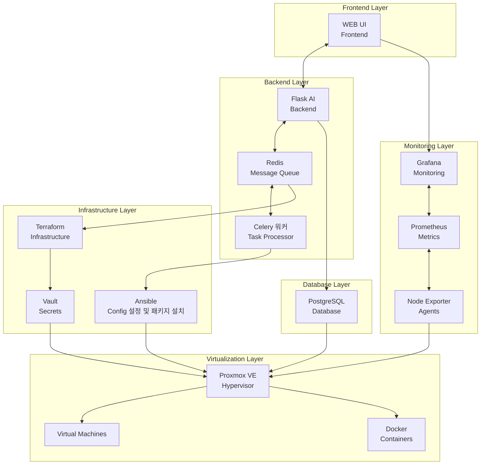

# 시스템 아키텍처 (Mermaid)



## 주요 데이터 흐름

### 1. 사용자 요청 → VM 작업
```
WEB UI → Flask AI → Redis → Celery 워커 → Terraform/Ansible → Proxmox VE → Virtual Machines
```

### 2. 모니터링 데이터 흐름
```
Node Exporter → Prometheus → Grafana → WEB UI
```

### 3. 데이터 저장
```
Flask AI → PostgreSQL ← Proxmox VE
```

### 4. 비밀 관리
```
Terraform → Vault → Proxmox VE
```

### 5. 실시간 알림 시스템
```
Celery 워커 → PostgreSQL → SSE 스트림 → WEB UI → 실시간 UI 업데이트
```

### 6. 인프라 자동화
```
Redis → Terraform → Vault → Proxmox VE
```

### 7. 설정 관리
```
Celery 워커 → Ansible → Proxmox VE
```
